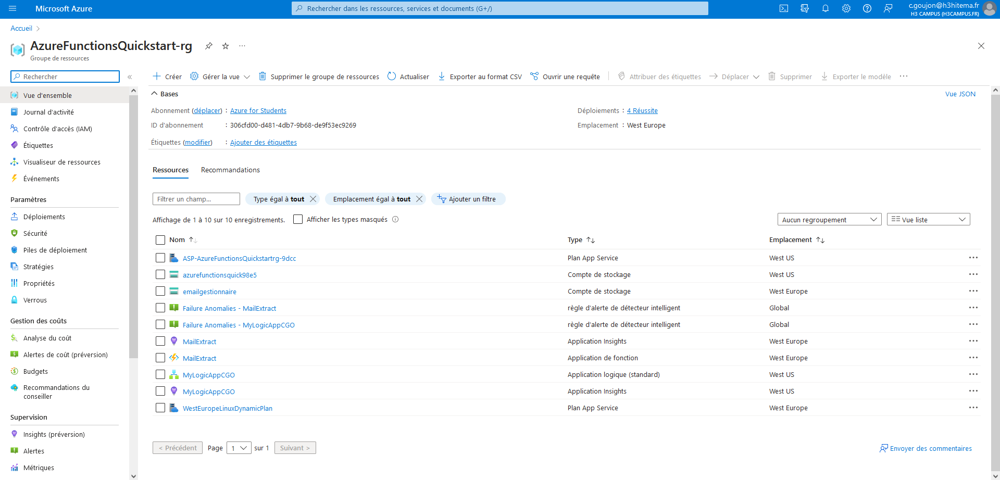
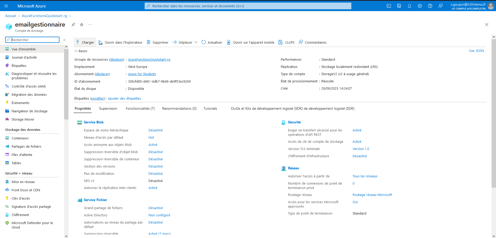
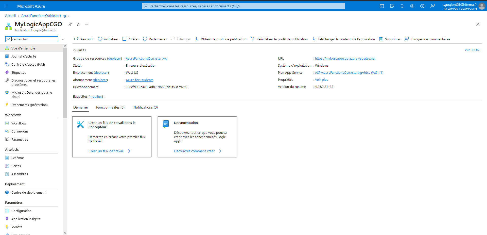

##  1 : Identification du Problème

- Confirmer que la gestion des e-mails des clients est un problème pertinent pour votre entreprise et qu'une automatisation pourrait améliorer l'efficacité du support client.

##  2 : Conception de la Solution

- Conception d'une architecture de solution qui comprend les services serverless Azure suivants : Azure Functions, Azure Logic Apps, Azure Cognitive Services, Azure Cosmos DB et Azure SendGrid (ou Azure Logic Apps pour les e-mails sortants).
- Créer un schéma de flux de travail pour montrer comment les différents services interagiront pour gérer les e-mails entrants et sortants.

##  3 : Configuration de l'Environnement Azure

- Créer un groupe de ressources dans Azure pour organiser vos ressources. Par exemple :

```bash
az group create --name AzureFunctionsQuickstart-rg --location westeurope
```



- Créer un compte de stockage Azure pour stocker les données et les fichiers nécessaires. Par exemple :

```bash
az storage account create --name emailgestionnaire --resource-group AzureFunctionsQuickstart-rg --location westeurope --sku Standard_LRS
```



##  4 : Implémentation de la Solution

###  4.1 : Azure Functions

Pour mettre en place une Azure Function en Python qui surveille les e-mails entrants en utilisant un déclencheur HTTP, suivre ces étapes :

#### Étape 1  Configuration de l'environnement de développement

Installer Azure Functions Core Tools en utilisant la commande suivante (cela vous permettra de développer et de tester localement) :

```python
pip install azure-functions-core-tools
``` 
#### Étape 2 : Création d'une Azure Function

Dans un terminal , créer un dossier pour votre projet Azure Functions.

Dans ce dossier, créer un nouvel environnement virtuel Python en utilisant  :
```bash
python -m venv venv
```
Activer l'environnement virtuel en fonction de votre système d'exploitation :
```bash
  venv\Scripts\activate
```

Installer le module Azure Functions en utilisant la commande suivante :
```bash
pip install azure-functions
```

Créer une fonction en utilisant la commande Azure Functions Core Tools suivante. Cette commande crée un projet de fonction avec un déclencheur HTTP :

```bash
    func init MyEmailFunction --python
```
#### Étape 3 : Ajout du code de fonction

Ouvrir le fichier **`function_app.py`** dans votre éditeur de code préféré et ajouter le code suivant :

```python
import azure.functions as func
import logging

app = func.FunctionApp(http_auth_level=func.AuthLevel.FUNCTION)

@app.route(route="Extract")
def Extract(req: func.HttpRequest) -> func.HttpResponse:
    logging.info('Python HTTP trigger function processed a request.')

    name = req.params.get('name')
    if not name:
        try:
            req_body = req.get_json()
        except ValueError:
            pass
        else:
            name = req_body.get('name')

    if name:
        return func.HttpResponse(f"Hello, {name}. This HTTP triggered function executed successfully.")
    else:
        return func.HttpResponse(
             "This HTTP triggered function executed successfully. Pass a name in the query string or in the request body for a personalized response.",
             status_code=200
        )
```

#### Étape 4 : Test local

Exécuter votre fonction localement en utilisant la commande suivante *(assurez-vous d'être dans le dossier de votre projet) *:
```bash
    func start
```
Cela démarrera un serveur local qui écoute sur le port 7071.

####  5 : Déploiement sur Azure

```bash

func azure functionapp publish ExtactMail
```
##### Mettre à jour les paramètres d’application

```bash
az functionapp config appsettings set --name MailExtract --resource-group MailExtract --settings AzureWebJobsFeatureFlags=EnableWorkerIndexing
```

###  4.2 : Logic Apps

- Configurer des Logic Apps pour définir des workflows automatisés en réponse à certains types d'e-mails. Par exemple :

```bash
az logic workflow create --resource-group AzureFunctionsQuickstart-rg --name MyEmailLogicApp --definition @definition.json
```


je voulais définir le déclencheur de cette façon :

```json
{
    "$schema": "https://schema.management.azure.com/providers/Microsoft.Logic/schemas/2016-06-01/workflowdefinition.json#",
    "contentVersion": "1.0.0.0",
    "parameters": {},
    "triggers": {
        "manual": {
            "type": "Request",
            "inputs": {
                "schema": {
                    "properties": {
                        "body": {
                            "type": "object"
                        },
                        "headers": {
                            "type": "object"
                        },
                        "host": {
                            "type": "string"
                        },
                        "method": {
                            "type": "string"
                        },
                        "path": {
                            "type": "string"
                        },
                        "queries": {
                            "type": "object"
                        }
                    },
                    "type": "object"
                }
            }
        }
    },
    "actions": {},
    "outputs": {}
}

```
mais n'ayant pas trouvé l'option sur le portail Azure, je n'ai pas pu tester cette partie.
Je me suis arrêté à cette étape, par la suite j'aurais aimé faire les étapes suivantes :
### 4.3 : Azure Cognitive Services

- Intégrer Azure Cognitive Services pour l'analyse du texte des e-mails entrants et la génération de réponses appropriées. Par exemple :

```bash
az cognitiveservices account create --name MyTextAnalyticsService --resource-group AzureFunctionsQuickstart-rg --kind TextAnalytics --sku S0 --location westeurope
```

###  4.4 : Azure Cosmos DB

- Utiliser Azure Cosmos DB pour stocker les données des e-mails et des réponses générées. Par exemple :

```bash
az cosmosdb create --name MyCosmosDB --resource-group AzureFunctionsQuickstart-rg --kind GlobalDocumentDB --locations "westeurope=0" --default-consistency-level Eventual
```

###  4.5 : Azure SendGrid ou Azure Logic Apps

- Configurer Azure SendGrid ou Azure Logic Apps pour envoyer automatiquement des réponses par e-mail aux clients. Par exemple :

```bash
az group deployment create --name SendGridDeployment --resource-group AzureFunctionsQuickstart-rg --template-uri "https://raw.githubusercontent.com/Azure/azure-quickstart-templates/master/101-sendgrid-create/azuredeploy.json" --parameters sendgridAccountName=MySendGridAccount
```

##  5 : Tests et Validation

###  5.1 : Test de la Solution

- Tester la solution en envoyant des e-mails simulés pour vérifier que les workflows automatisés fonctionnent correctement. Par exemple :

```bash
az functionapp function invoke --name MyEmailFunction --resource-group AzureFunctionsQuickstart-rg --function-name MyEmailFunction --data "{ 'subject': 'Test Email', 'body': 'This is a test email body' }"
```

- Vérifier que les réponses générées sont appropriées et précises.
- Verifier que les données sont correctement enregistrées dans Azure Cosmos DB en consultant la base de données à l'aide de cette requete : 

Supposons la base de données Cosmos appelée "MyCosmosDB" avec une collection nommée "Emails". Nous pouvons exécuter une requête SQL pour récupérer tous les documents de cette collection. Par exemple:
```bash

az cosmosdb sql query --account-name MyCosmosDB --database-name MailTable --container-name Emails --query "SELECT * FROM MailTable"
```
